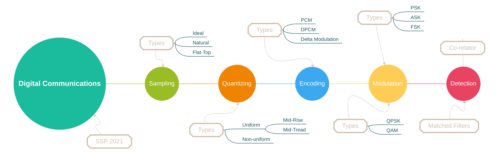

### Index {.tabset}

#### Intro

#### Contents

* <a href="sampling/sampling.html">Sampling</a>
* <a href="quantization/quantization.html">Quantization</a>
* <a href="modulation_techniques/modulation_techniques.html">Modulation  Techniques (baseband) </a>
* Broadband Modulation (PSK - ASK - FSK)
* Detection

