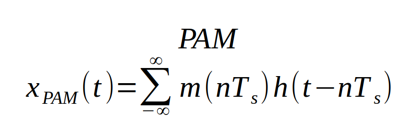
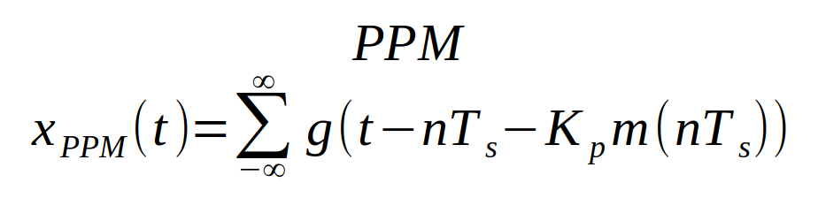

## Modulation Techniques {.tabset}

### Intro

### Rules

### Notes

#### PAM
* pulses have the same *position* and *width*, amplitude varies with data signal

#### PWM / PDM
* Amplitude is constant, width varies with the data signal

#### PPM
* The position of a pulse is relative to its  unmodulated time 

### Go Back

<a href="../index.html">Index</a>

##
