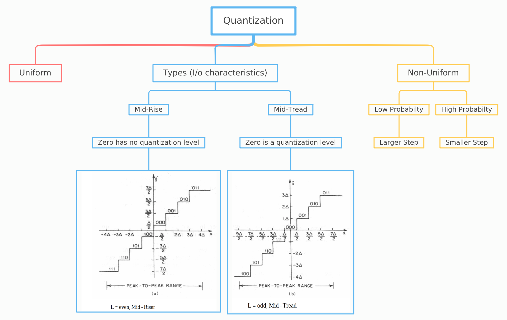
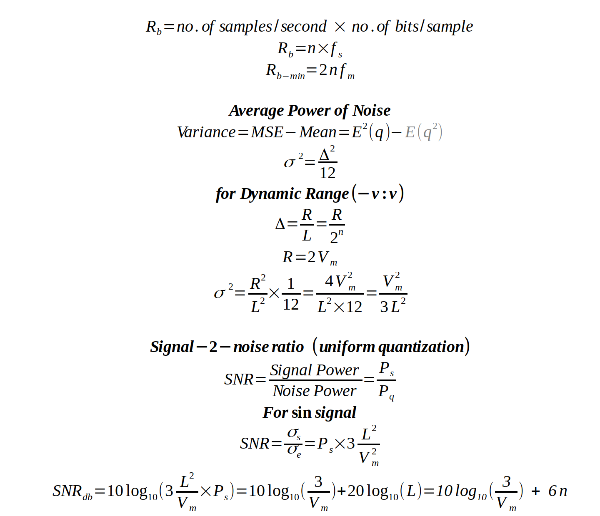
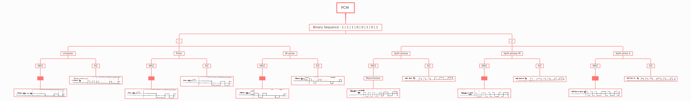
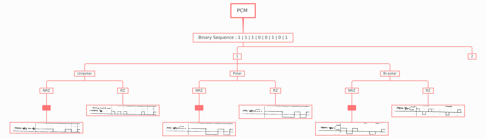
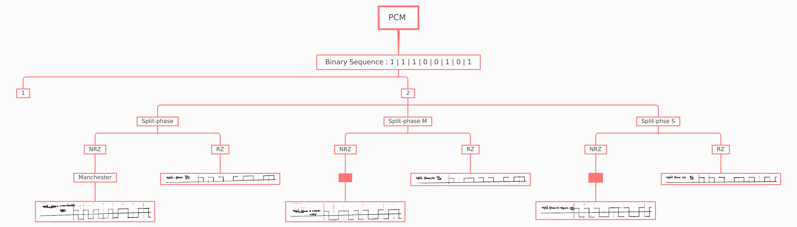
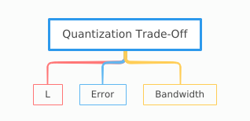

### Quantization & PCM encoding {.tabset}

#### Intro

#### Rules

#### PCM

#### Notes

* The higher L( or n) , the lower error 👏
* The higher n, the higher bandwidth 😕

| Type           | Unipolar       | Polar          | Bipolar        |
| :------------- | :------------- | :------------- | :------------- |
| NRZ            | BW = Rb| BW = Rb| BW = Rb|
| RZ             | BW = 2Rb| BW = 2Rb| 2BW = Rb|

#### Go Back

<a href="../index.html">Index</a>

#

