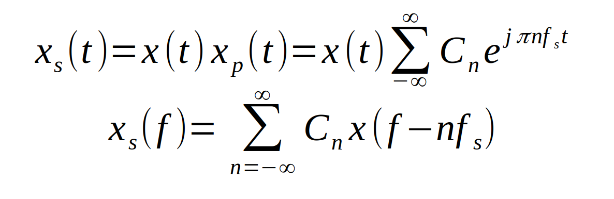

## Sampling {.tabset}

### Intro

### Rules

<!-- $$ x_s(t) = x(t) x_\delta(t)= x(t)\sum_{n=-infty}^{infty}\delta(t-nT_s)$$ -->

<!--  -->

#### Ideal

#### Natural

#### Flat-Top

### Notes

##### Nyquiest Criterion
* The value of sampling frequency fs must be greater than twice  the highest signal frequency fmax of the signal
**fs >= 2fman**

##### Natural Sampling
* Natural Sampling is not compatible with a digital system since the amplitude of each sample has infinite number of possible values.

<script type="text/javascript" async

src="https://cdn.mathjax.org/mathjax/latest/MathJax.js?config=TeX-MML-AM_CHTML">